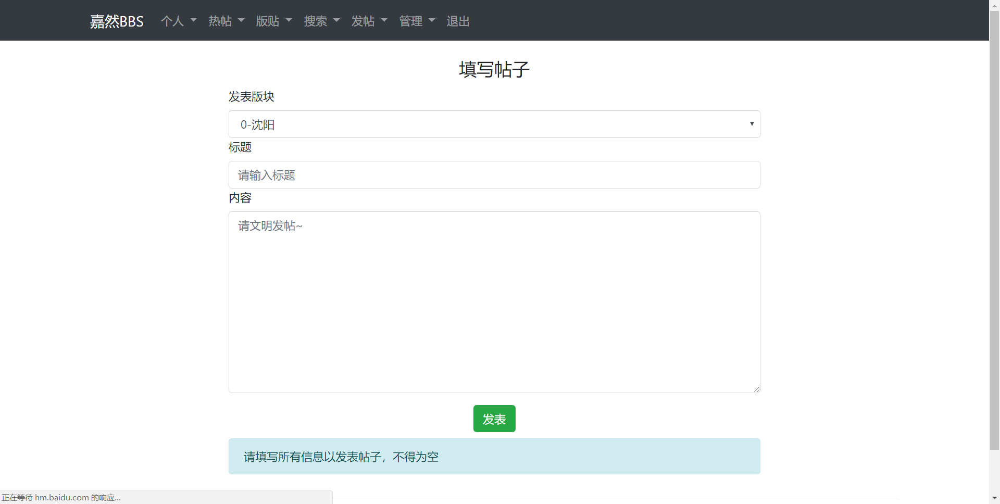
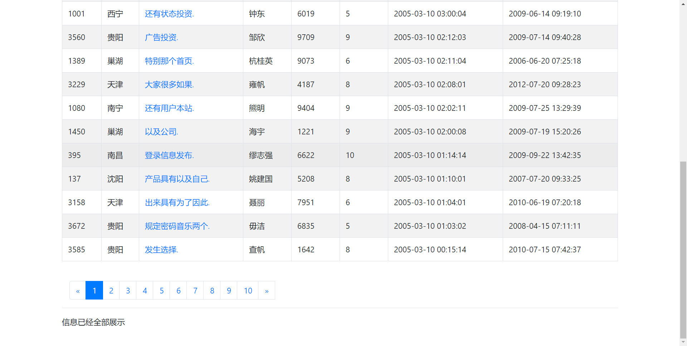
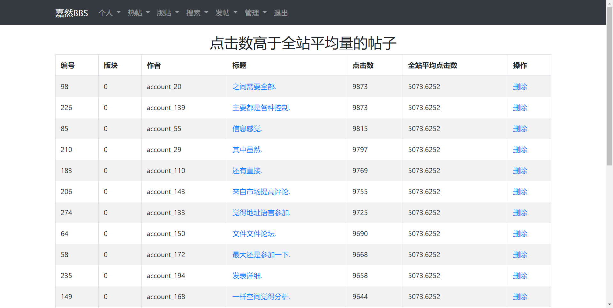
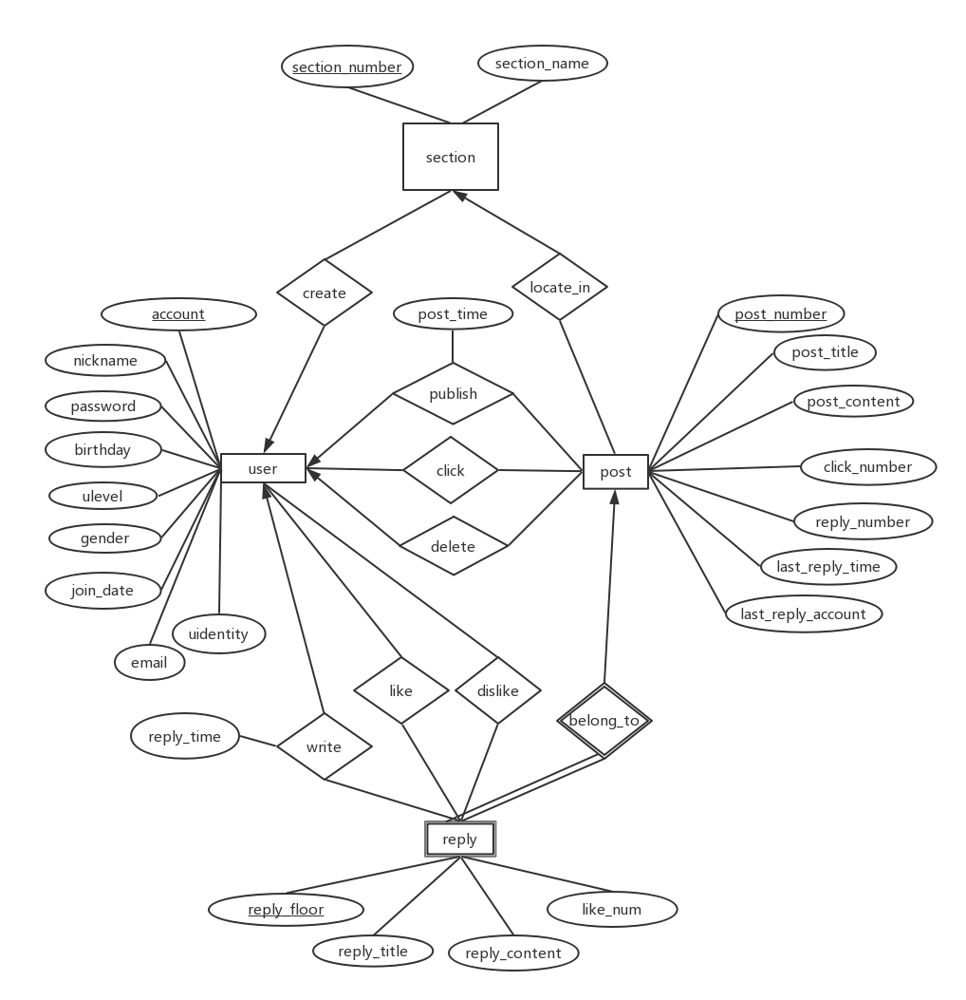

# pku_BBS说明

### 1、开发说明

这是一个**极简但是又功能齐全而且界面美观**的BBS，真是太棒了，现在已经开发完成！

**开发者：**

- 陈浩然	北京大学智能系
- 郑嘉毅     北京大学计算机系

**开发技术：**

- 使用语言：Python+HTML+CSS+JavaScript+SQL

- 数据库：MySQL
- 前后端框架：flask
- 前端装饰：bootstrap

**工程量**：约三千行代码

**开发用时**：15天*人

**人员分工：**

- 郑嘉毅：
  - 数据库各种关系模式的创建
  - 数据库触发器的编写
  - 论坛个人动态，部分搜索，管理、分页等功能的前后端
  - Apache的配置运行

- 陈浩然：

  - HTML和bootstrap模板的编写
  - 论坛登录注册部分前后端
  - 论坛个人信息，热帖，版贴，部分搜索，发帖等功能的前后端
  - E-R图，关系模型，readme的书写


### 2、界面概览











### 3、BBS说明

BBS信息：

**名称**：嘉然BBS

**支持的功能**：

- 登录、注册功能，注册自动成为普通用户
- 登录时检查账户类型进入不同界面的BBS
- 查看个人信息
- 查看个人最近动态
- 查看点击前十和回复前十的热帖列表
- 查看版块列表
- 查看版块中的帖子列表，支持分页
- 查看时间序的全部列表，支持分页
- 查看某个帖子的具体内容
- 回复某个帖子
- 删除回复
- 向某个版块发帖
- 各种搜索功能，包括
  - 搜索用户
  - 搜索帖子
  - 分版块用户检索
  - 寻找版块热帖和回复人
  - 等等等等
- 版主管理功能，进行其版块的管理
- 管理员管理功能，管理一切BBS中的数据
- 404功能，自定义404页面
- 自动监视功能，将异常流量用户自动发送给管理员
- 退出功能，清理用户信息防止信息泄露
- 自动适配功能，适配不同大小的屏幕
- .......其他功能等待您发现

总之，我们的BBS**又简洁又美观又强大**！


### 4、设计细节

#### E-R图

（图中reply_floor应该虚下划线，由于软件无此功能故以实线代替）



#### 关系模式表

1、用户信息表：user_info

| 属性               | 数据类型    | 备注     |
| ------------------ | ----------- | -------- |
| **<u>account</u>** | VarChar(20) |          |
| nickname           | VarChar(20) |          |
| password           | VarChar(20) |          |
| birthday           | DATE        | 精确到日 |
| gender             | SMALLINT    |          |
| email              | VarChar(40) |          |
| ulevel             | SMALLINT    |          |
| join_data          | DATETIME    | 精确到秒 |
| uidentiey          | SMALLINT    | 0/1/2    |

2、版块名称表：sec_info

| 属性                      | 数据类型    | 备注                     |
| ------------------------- | ----------- | ------------------------ |
| **<u>section_number</u>** | Int         | 看情况应该不超过21亿版块 |
| section_name              | VarChar(40) |                          |

3、帖子信息表：post_info

| 属性                     | 数据类型    | 备注                   |
| ------------------------ | ----------- | ---------------------- |
| **<u>post_number</u>**   | int         |                        |
| ***section_number***     | Int         |                        |
| ***account***            | VarChar(20) | 有冗余，但可以提高性能 |
| ***nickname***           | VarChar(20) | 有冗余，但可以提高性能 |
| post_title               | varChar(50) |                        |
| post_content             | text        |                        |
| post_time                | DATETIME    | 精确到秒               |
| click_number             | Int         |                        |
| reply_number             | Int         |                        |
| last_reply_time          | DATETIME    |                        |
| ***last_reply_account*** | VARCHAR(20) |                        |

4、回帖信息表：reply_info

| 属性                     | 数据类型    | 备注                   |
| ------------------------ | ----------- | ---------------------- |
| *<u>**post_number**</u>* | INT         | 也是外码               |
| **<u>reply_floor</u>**   | INT         |                        |
| ***account***            | VarChar(20) | 有冗余，但可以提高性能 |
| ***nickname***           | VarChar(20) | 有冗余，但可以提高性能 |
| reply_title              | varChar(50) |                        |
| reply_content            | text        |                        |
| reply_time               | DATETIME    | 精确到秒               |
| like_num                 | Int         |                        |

5、版主表（n对n，所以专门设一个表）：moderator_info

| 属性                        | 数据类型    | 备注     |
| --------------------------- | ----------- | -------- |
| <u>***section_number***</u> | Int         | 也是外码 |
| <u>***account***</u>        | VarChar(20) | 也是外码 |

6、管理员邮箱（用来监视流量异常用户）：dba_mailbox

| 属性     | 数据类型      | 备注          |
| -------- | ------------- | ------------- |
| sender   | VARCHAR（20） | 可以为systems |
| content  | text          |               |
| tag_time | datetime      |               |
| if_read  | SMALLINT      |               |


### 5、程序使用说明

1、安装主要的python包，主要是pymqsql、faker、flask、xml

2、自行配置MySQL，参数为

（当然这是我们的配置，可以自行更改）

```python
DB_conf = {
    'host': 'localhost',
    'user': 'root',
    'password': '123456',
    'database': 'jrbbs',
    'port': 3306,
    'charset': 'utf8mb4'
}
```

3、运行dbop.py创建实例数据，该过程较慢，需要一分钟左右

```python
if __name__ == '__main__':
    db_con = DB(DB_conf)
    db_con.generate_data()
```

4、运行bbs.py文件，即可在本机网页访问

```python
* Serving Flask app "bbs" (lazy loading)
* Environment: production
  WARNING: Do not use the development server in a production environment.
  Use a production WSGI server instead.
* Debug mode: off
* Running on http://127.0.0.1:5000/ (Press CTRL+C to quit)
```

5、（可选，非必须）配置Apache，使其在服务器上运行


### 6、结语

数据库大作业完成了，我们尽了最大的努力，如果BBS有部分没做好的地方，请原谅我们的疏忽，我们后续会继续 改进！

感谢李老师和助教们这学期的认真教导，数据库是一门很重要的课程，希望在老师助教的教授下、我们的努力下，最终能够取得令人满意的成绩！